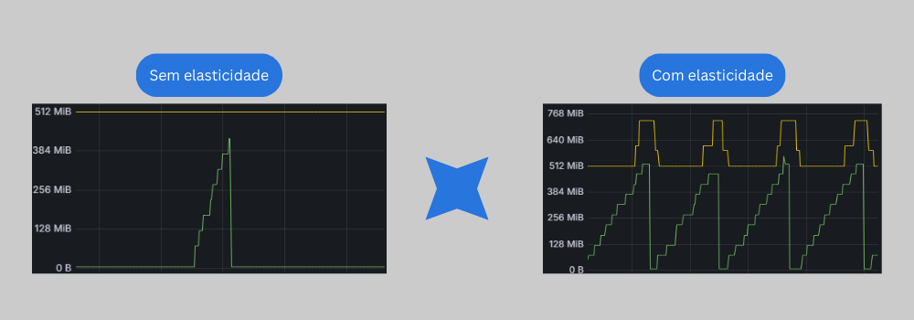

# Controlador de Elasticidade de Contêineres Docker 🐳

## Objetivo

Esse projeto teve como objetivo o desenvolvimento de um controlador de elasticidade vertical reativo para o Container Runtime Docker. 

### Funcionamento

- O controlador monitora os recursos em utilização utilizando o cAdvisor que é uma ferramenta desenvolvida pelo Google especificamente para coletar, processar e expor métricas relacionadas ao desempenho de contêineres,
- A partir das métricas expostas pelo cAdvisor (que podem ser analisadas em localhost:8080/metrics) o Pormetheus utiliza seu _Service Discovery_ para _scrapear_ tais métricas,
- Com as métricas armazenadas no TSDB (Time-series Database) do Prometheus, tanto o `main.go` quanto o Grafana consultam as métricas utilizando as _queries_ do PromQL (que é a linguagem de Query do Prometheus),
- Essas métricas coletadas então são utilizadas para fazer a análise de utilização de CPU e memória do container, para que o controlador decida se será ou não necessário a alocação ou liberação de recursos.
  - O Grafana é utilizado para facilitar a criação de visualizações dinâmicas sobre a saúde do sistema.


### Instalação

Os pré-requisitos são o `Docker`, `Docker Compose` e `Golang`. Clone o repositório logo em seguida:

```
sudo apt update && sudo apt install docker.io golang-go

sudo curl -L "https://github.com/docker/compose/releases/latest/download/docker-compose-$(uname -s)-$(uname -m)" -o /usr/local/bin/docker-compose
sudo chmod +x /usr/local/bin/docker-compose

git clone https://github.com/marcoodamo/elasticity-controller-Docker.git
```

Inicialize o módulo Go e compile o controlador:
```
go mod init elasticity-controller
go mod tidy
```

### Como utilizar?

Com o intuito de deixar tudo o mais automatizado possível, o projeto foi desenvolvido para que o deploy do ambiente seja feito em contêineres utilizando o docker-compose. Para fazer o deploy dos serviços, é necessário executar o comando:

```
docker-compose up
```

As integrações necessárias para o funcionamento básico já estão configuradas nos manifestos do compose e prometheus. É importante ressaltar que, caso o `container_name` seja modificado, é necessário fazer a alteração no código `main.go`, já que a relação de endpoint é feita através dessa variável. Você pode achar estranho no meu código o `container_name` ser `nginx-monitored` porém na verdade é um container com Python e alguns códigos, isso se dá pelo fato de que um site está em desenvolvimento para melhorar a realização dos testes de estresse! Porém, caso deseje utilizar sua própria imagem de benchmark, apenas modifique a imagem do container.

Após ter feito o deploy dos serviços, você pode rodar o controlador de elasticidade que ele irá começar a fazer a análise de utilização de recursos:

```
go run main.go
```

#### Observabilidade

Para validar as métricas de consumo de recursos em tmepo real, você tem três opções:
1. Acessar o cAdvisor em `localhost:8080/docker` e selecionar o container que deseja,
2. Acessar o Prometheus em `localhost:9090/query`, selecionar "Graph" e inserir a query que deseja,
3. Ou, a que eu aconselho, acessar o Grafana em `localhost:3000`, configure o Data Source como o Prometheus (colocando a URL http://prometheus:9090). Depois vá em Dashboards > New Dashboard > Add visualization e crie suas visualizações. Recomendo utilizar as seguintes queries:

   3.1. Memória (para ajustar a visualizaçào, no meu lateral esquerdo, vá em Standard options > Unit > Data > bytes(IEC)), ajsute também as informações de Query options para reduzir o tempo que o gráfico deve considerar (Relative time), aconselho _Min interval_ e _Time shift_ sendo 1s. Adicione duas queries na mesma visualização:

   ```
   container_memory_usage_bytes{name="nginx-monitored"}
   ```
   ```
   container_spec_memory_limit_bytes{name="nginx-monitored"}
   ```

   3.2 CPU, ajsute também as informações de Query options para reduzir o tempo que o gráfico deve considerar (Relative time), aconselho _Min interval_ e _Time shift_ sendo 1s. Adicione duas queries na mesma visualização:

   ```
   irate(container_cpu_usage_seconds_total{name="nginx-monitored"}[15s])
   ```
   ```
   container_spec_cpu_quota{name="nginx-monitored"} / 100000
   ```
       
  
A primeira query (linha verde) significa o recurso demandado em tempo real, enquanto a segunda (linha amarela) representa a quantidade de recursos alocados no container.

E pronto! Agora você consegue analisar a elasticidade nos conteineres Docker. Abaixo mostro o comportamento do controlador em casos de picos periódicos que ultrapassariam a memória limite do container (e o OOM Killer iria encerrar o processo)!



Você consegue citar esse repositório apenas clicando em "Cite this repository" abaixo da Licença no menu lateral direito 🥳

### Tecnologias
[](https://www.docker.com/)
[](https://prometheus.io/)
[](https://grafana.com/)
[](https://golang.org/)
[](https://www.cloudflare.com/)
[](https://github.com/google/cadvisor)

### [](https://git.io/typing-svg)

[](https://www.linkedin.com/in/marco-antonio-damo/)
[](mailto:marco_damo@hotmail.com)

